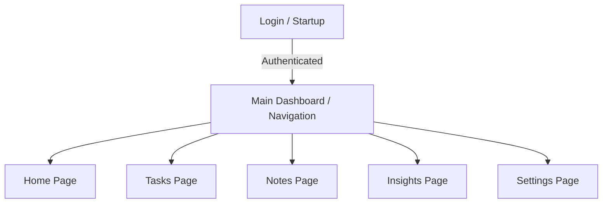

# PlanIt — Product Requirements Document (PRD)

This document serves as the comprehensive and definitive requirements specification for **PlanIt**, a premium, game-inspired Android scheduling, task, and note management application. It consolidates all requirements, settings, features, and user-aligned decisions.

---

## 1. Overview & General Requirements

### 1.1 Brand Identity & App Name
*   **App Name:** PlanIt
*   **Target Platform:** Android (Native)
*   **Minimum Android SDK:** Android 13 (API Level 33) — allowing the application to utilize modern features like granular post-notification permissions, themed app icons, and modern system-level APIs.
*   **Localization Support:** Bilingual support out-of-the-box (English and Ukrainian). The user interface, system messages, and default settings will be localized dynamically based on system locale or in-app preference.

### 1.2 Core Philosophy & Experience
PlanIt is designed to be an elegant, premium organizer that keeps the user engaged through visual elegance, seamless integration, and gamified progress. It must not look or feel like a basic utility app. It should feature custom Google Fonts (e.g., Outfit or Inter), smooth micro-animations, clean card elevation, custom themes (light, dark, system), and distinct, consistent color-coding throughout all screens.

---

## 2. Technical Stack & Architecture

### 2.1 Front-End (Android Client)
*   **Language:** 100% Kotlin
*   **UI Framework:** Jetpack Compose (using Material 3 guidelines, adapted for custom high-end styles like glassmorphism and subtle gradients)
*   **State Management:** MVVM Architecture with ViewModels, StateFlow/SharedFlow, and Kotlin Coroutines for asynchronous work
*   **Local Caching / Local DB:** Room Database (Offline-first approach)

### 2.2 Backend & Cloud Integration
*   **Platform:** Firebase (Google Cloud Suite)
    *   **Authentication:** Firebase Authentication (supporting Google Sign-In and Email/Password credentials)
    *   **Remote Database:** Cloud Firestore (for real-time synchronization, structured storage, and cross-device consistency)
    *   **Cloud Functions / Storage:** (If needed for server-side processing or profile pictures)
*   **Sync Behavior:** Dual-synchronization:
    *   Data is written to the local Room database first (fully functional offline).
    *   When an active internet connection is detected, Room changes are synced to Cloud Firestore.
    *   Conflict resolution uses a "Last-Write-Wins" policy based on microseconds timestamps embedded in the record metadata.

---

## 3. Core Feature Details by Screen

### 3.1 Home Page (Schedule & Hour-by-Hour Plan)
The central hub for organizing the day, managing calendar items, and reviewing upcoming timelines.

*   **Hour-by-Hour Timeline:**
    *   Visual representation of the day's hours (similar to Google Calendar).
    *   Add plans directly to specific time slots.
    *   Configurable duration with a minimum step increment of 15 minutes.
    *   Each plan card supports:
        *   Title and description fields.
        *   Subtasks checklist (rendered using Markdown checklist notation: `- [ ]`).
        *   Flexible reminders (user selects relative trigger times, e.g., 5 min, 15 min, 1 hour before).
*   **Calendar Timeline Navigation:**
    *   Header displaying current date, day of week, and a horizontal calendar strip to easily swipe or tap to navigate across days.
*   **Upcoming Plans Ticker:**
    *   A dynamic marquee/ticker or a designated clean top section showing plans starting soon.
    *   Clicking a card in this section automatically scrolls the timeline to the corresponding plan and plays a subtle highlight/pulse animation.
*   **Quick-Access Settings:**
    *   A triple-dot or gear icon in the page header allowing rapid access to schedule-specific filters, timeline view presets, and display settings.
*   **Note Integration Block:**
    *   A compact section showing shortcuts/anchors to notes attached to the current day. To prevent layout clutter, notes do not display full content inline here, only interactive title tags that open the note when clicked.
*   **Schedule Presets & Snapshots:**
    *   A preset creation/application button.
    *   Users can capture a snapshot of their current schedule structure (e.g., "Workday Plan", "Weekend Routine").
    *   Presets capture plans, tasks (filtered to "Today" target), and specific checklist templates.
    *   Applying a preset overwrites or merges with the current day's plan.
*   **Training & Trainer Sync Module:**
    *   An integration endpoint to pull workouts/training schedules.
    *   To save screen real estate, this data resides inside an expandable slide-out menu or a collapsible drawer, accessible but non-intrusive on the main timeline.
*   **Plan Interaction Safeguard:**
    *   To prevent accidental edits, plans and associated subtasks *cannot* be edited directly from the main scrollable timeline. Double-tapping or clicking them triggers an edit window transition.

---

### 3.2 Tasks Page
Focuses on tracking actionable items, productivity statistics, and separating immediate actions from long-term projects.

*   **Completion Summary Dashboard:**
    *   A prominent visual gauge (circular progress indicator with clean animations) illustrating tasks planned for today vs. completed today.
    *   If the user hits 100% completion, a motivational message (with a minor visual reward/confetti effect) is shown.
*   **Task Creation Form:**
    *   Title and description fields.
    *   Option to attach notifications/reminders at a specific hour/date.
    *   **Day Attachment Toggle:**
        *   *Enabled:* The task is counted towards today's progression metrics and shows on the daily schedule.
        *   *Disabled:* The task is designated as "Long-Range".
*   **Long-Range Tasks Mode:**
    *   A dedicated button toggles the view between Today's Tasks and a clean, filtered list of Long-Range Tasks.
*   **Cross-Linked Subtasks:**
    *   Subtasks derived from plans on the Home Page are visible on the Tasks Page as dedicated task cards.
    *   Subtask cards explicitly show the parent plan's name, execution time, and a distinct link icon.
    *   Clicking a subtask card redirects the user back to the Home Page timeline, scrolling directly to and highlighting the source plan.
*   **Interaction Gestures:**
    *   Single-tap: Toggle completion state (checkbox check/uncheck animation).
    *   Double-tap task card: Opens the inline task editor.
    *   Double-tap subtask card: Opens the parent plan editor modal directly.

---

### 3.3 Notes Page
A rich-text playground allowing the user to dump thoughts, draft content, and create interactive widgets.

*   **Editor & Preview Structure:**
    *   Split-screen editor or instant Markdown renderer.
    *   Large content area that dominates the editing window, designed to fit long documents comfortably.
    *   Full Markdown standard support (headers, bold, italics, code blocks, lists, links).
*   **Markdown Checklist Helper:**
    *   A quick-access toolbar shortcut button to instantly paste/insert the task notation `[ ]` at the cursor position.
*   **Daily Plan Attachment:**
    *   Toggle to associate the note with the current calendar day, making its shortcut visible in the Home Page's note section.
*   **Sharing and Exporting:**
    *   Integration with Android's system share sheet to export plain text, HTML, or parsed Markdown.
    *   Direct export to file storage as a raw `.md` (Markdown) file.
*   **Homescreen Notes Widget:**
    *   An Android system widget displaying selected notes or a list of recent notes.
    *   Tapping a note in the widget opens the app and routes directly to that note's editor.

---

### 3.4 Insights & Gamification Page
A dashboard tracking behavioral trends, progress stats, and turning productivity into a rewarding game.

*   **Daily Analytics Dashboard:**
    *   Total tasks created vs. completed.
    *   Notes written.
    *   Google Calendar syncing events.
    *   Overall productivity curve charts.
*   **Gamification Engine (Medium Complexity):**
    *   **XP (Experience Points):** Earned by doing productive things:
        *   Completing a Task: `+15 XP`
        *   Completing a Plan's Subtask: `+10 XP`
        *   Completing all plans & tasks for a day (100%): `+50 XP` bonus
        *   Creating and saving a Note: `+5 XP`
        *   Maintaining a synchronization streak: `+10 XP`
    *   **Levels:** Progression formula: $XP_{needed} = Level \times 150$. Leveling up triggers a celebration screen with sound and animations.
    *   **Daily Streaks:** Tracks consecutive days with at least 1 task or plan completed. Multipliers apply to XP gains for high streaks.
    *   **Achievements & Badges:** Unlockable badges (e.g., "Early Bird" for completing a plan before 8:00 AM, "Note Taker" for writing 10 notes, "Unstoppable" for a 7-day streak). Badges are displayed in a clean, visual trophy cabinet.

---

### 3.5 Settings Page
Highly flexible controls to custom-tailor the application's behavior.

*   **User Profile Management:**
    *   Displays current account photo, email, and nickname.
    *   Multi-Account Switcher: Smooth login swap allowing users to change profiles quickly.
    *   Logout function: Directs the user back to the login screen. *Offline usage is blocked if the user is not actively logged in.*
*   **Granular Notification Panel:**
    *   Master toggle for all notifications.
    *   Separate toggle switches for:
        *   Daily plans starting soon
        *   Tasks due reminders
        *   Streak break warnings
        *   Gamification / Level-Up sound and banners
*   **Notification Audio Controls:**
    *   Independent notification volume slider.
    *   Audio profile picker allowing selection from custom sound clips (e.g., soft chimes, clear rings, muted alert).
*   **Google Calendar Sync Panel:**
    *   Enable/Disable entire Google Calendar sync.
    *   Toggle automatic upload: When enabled, all newly created plans instantly push to Google Calendar.
    *   *Manual Upload Mode (If Auto is Off):*
        *   To upload a plan to Google Calendar: Swipe right on the plan card on the Home Page and confirm.
        *   To delete/remove a plan from Google Calendar: Swipe left on the plan card on the Home Page and confirm.
*   **Theme Switcher:**
    *   Choices: Light Mode, Dark Mode, or System Default. Colors must adjust seamlessly without requiring an app restart.

---

## 4. UI Style Guide & Harmonious Color Palette

To keep the application visual system consistent and intuitive, a uniform color-coding scheme will be used across all modules.

| Item Type | Suggested Color (Hex) | HSL Values | Description / Usage |
| :--- | :--- | :--- | :--- |
| **Daily Tasks (Independent)** | `#2ECC71` | `HSL(145, 63%, 49%)` | Normal task cards, completed items, standalone checklist steps |
| **Subtasks (Plan-linked, Offline)** | `#5C6BC0` | `HSL(231, 48%, 56%)` | Tasks tied to a local schedule plan that does not push to Calendar |
| **Subtasks (Plan-linked, Synced)** | `#FFB300` | `HSL(42, 100%, 50%)` | Tasks tied to plans that are actively synchronized with Google Calendar |
| **Meetings & Events** | `#FF7043` | `HSL(14, 100%, 63%)` | Blocks designated as meetings or events containing participants |

### Aesthetics Checklist:
1.  **Gradients:** Use soft gradients for headers and card backdrops instead of block colors.
2.  **Visual Depth:** Cards should use subtle shadows (elevation) or glassmorphism (semi-transparent backgrounds with background blur) on modern Android runtimes.
3.  **Micro-animations:** Level ups, task checking, and tab transitions must use animated transitions (using Jetpack Compose standard animated visibility and transition APIs).

---

## 5. Device & Notification Integration

### 5.1 Smart Band & Watch Integration (Xiaomi Mi Band / Amazfit)
*   **Mechanism:** Rather than building a companion app for Zepp OS or Mi Fit, the app will structure notifications so they are fully compatible with standard Android notification parsing.
*   **Formatting:**
    *   Notifications will use clean, short header summaries suitable for small wrist displays.
    *   Reminders include action buttons (e.g., "Done", "Snooze 10m").
    *   Smartwatch notification feeds will receive upcoming event tickers if the user enables the custom wrist-notification profile.
*   **Upcoming Action Ticker in System Tray:**
    *   A persistent, updateable system notification that shows the active plan and lists the *immediate next action* in the description line.

---

## 6. Verification and Acceptance Criteria

### 6.1 Authentication & Guardrails
*   **Requirement:** App must launch directly to the Authentication page if there is no cached token.
*   **Requirement:** Clicking "Logout" deletes local credentials/tokens and prevents navigation to the main dashboard.

### 6.2 Calendar Synchronization Verification
*   **Test Case (Auto-sync ON):**
    1. Create a plan in the app.
    2. Open Google Calendar (browser or native app).
    3. Verify that the event is created with correct name, start time, and duration.
*   **Test Case (Auto-sync OFF):**
    1. Create a plan in the app.
    2. Verify it does not appear in Google Calendar.
    3. Swipe right on the plan, tap "Confirm Sync".
    4. Verify it is now present in Google Calendar.
    5. Swipe left on the plan, tap "Confirm Delete".
    6. Verify it is removed from Google Calendar.

### 6.3 Gamification Engine Check
*   **Test Case:**
    1. Note user's current XP.
    2. Mark a task as completed.
    3. Verify that XP increases by exactly `15 XP`.
    4. If XP threshold is crossed, verify level increases, progress bar resets, and level-up animation triggers.
